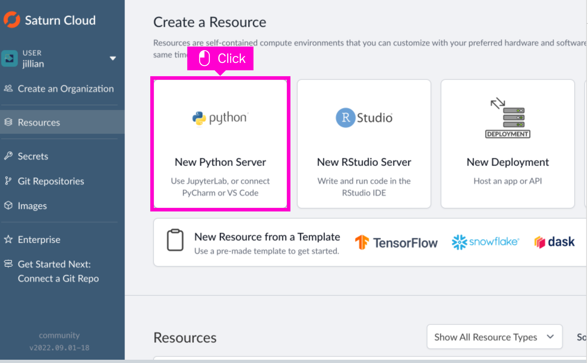
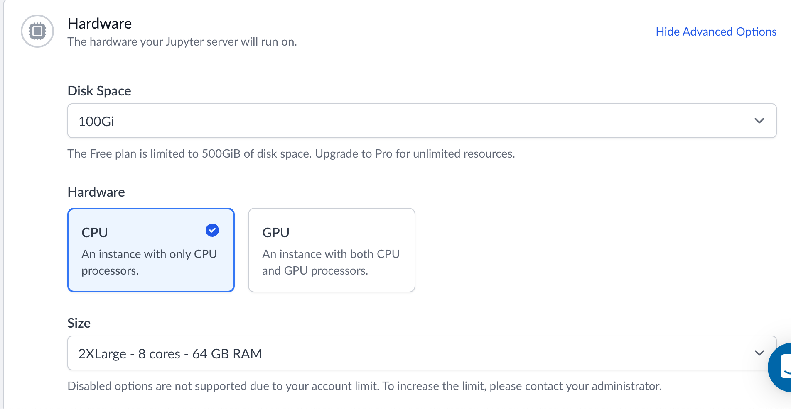
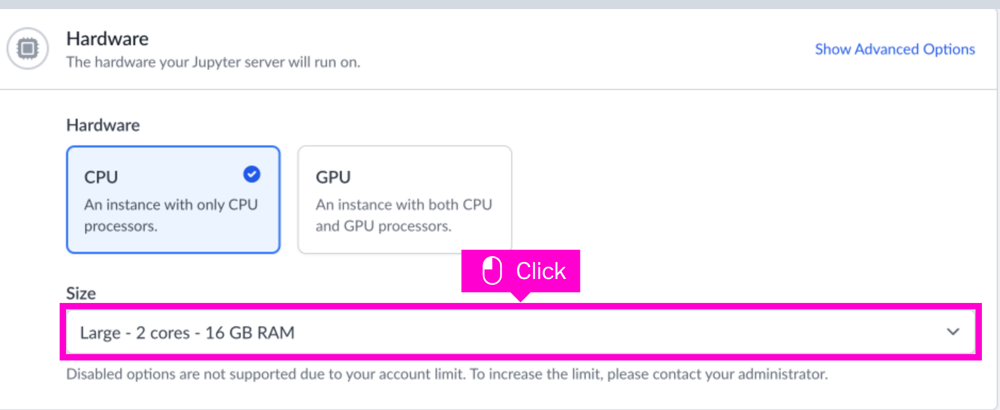
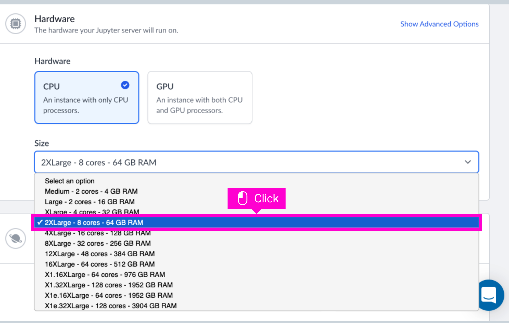
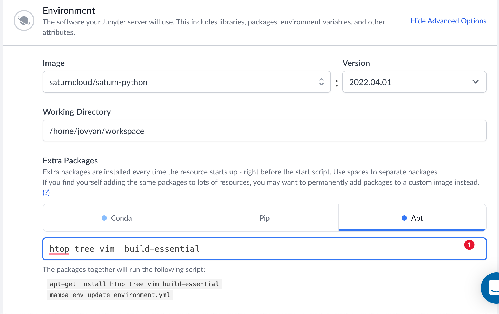
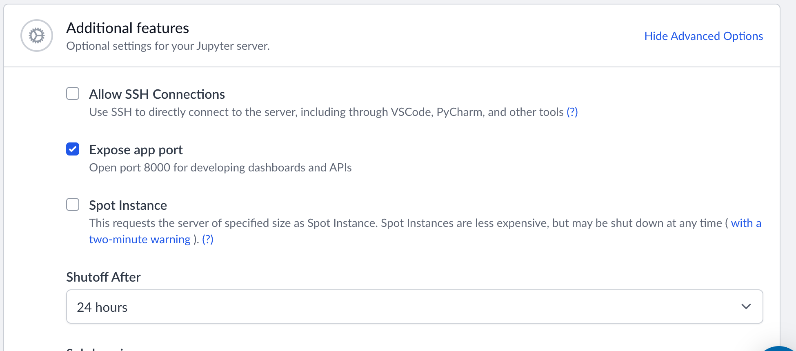
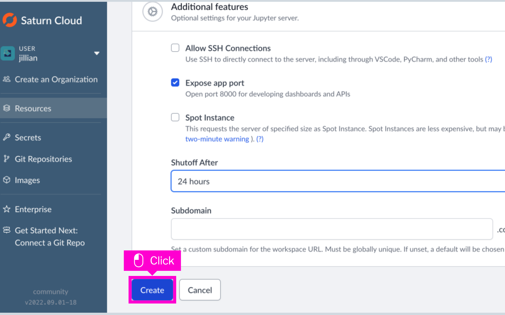

# Single Cell Analysis on Saturn Cloud

## Requirements

* A saturn cloud account. 
    * The free account is fine for this example.
* Optionally, instead of Saturn Cloud you can use any computer with conda/mamba and internet connectivity.
* Optional - S3 Bucket with Read/Write access.

That's it!

## Setup - Saturn Cloud

The Saturn Cloud UI is fairly self explanatory. 

### Create a Resource

* Create a new Python Server resource type.


### Choose your Hardware Specs

* Choose a CPU Instance Type
 
   (We're not doing anything here that requires a GPU.)
* Choose your memory requirements
  * From the Size dropdown choose an instance type.



### Environment

* Customize your environment



  * I went with the default saturn cloud datascience environemnt. If you're using tensorflow or pytorch you may want to choose those environments.
* Add your System Packages of choice. I went for `htop tree vim build-essential`
* Optional - Add your pip packages. `scanpy louvain quilt3[catalog,pyarrow]`

* Open a Port for Web Applications
    * Click on the *Advanced Options* in the **Environment** tab in order to open a port.
    * This step is necessary if you want to follow along with the visualization portion of the tutorial!
  


## Review and Launch

* Once you've reviewed your settings click *Create* and you'll be ready to go.



On the next page press the *Start* button, and then the *JupyterLab* button.


### Optional - ExcellxGene Setup

Excellxgene needs to be installed to it's own conda environment because it doesn't play nice with the existing conda env.

* Grab the `excellxgene-environment.yaml` from this repo.
* Create the excellxgene environment
* Register the excellxgene environment as a Python Kernel.

Setup is the same whether you are using Saturn Cloud, running locally, or using an HPC system.

```bash
wget https://raw.githubusercontent.com/dabble-of-devops-bioanalyze/single-cell-saturn-cloud/main/excellxgene-environment.yaml
mamba env create -f ./excellxgene-environment.yaml -p ~/.conda/envs/excellxgene
source activate conda activate /home/jovyan/.conda/envs/excellxgene
```

If you are running on a local system or [BioAnalyze HPC](https://hpc.bioanalyze.io) I recommend using [these](https://hpc.bioanalyze.io/software/install-software.html) settings.

## Data Analysis

You can grab the [scanpy tutorials](https://github.com/scverse/scanpy-tutorials) with:

```bash
git clone https://github.com/scverse/scanpy-tutorials
wget https://raw.githubusercontent.com/dabble-of-devops-bioanalyze/single-cell-saturn-cloud/main/excellxgene-environment.yaml
wget https://raw.githubusercontent.com/dabble-of-devops-bioanalyze/single-cell-saturn-cloud/main/prepare.py
wget https://raw.githubusercontent.com/dabble-of-devops-bioanalyze/single-cell-saturn-cloud/main/pbmc3k.ipynb
```

I'm only going over the `pbmc3k.ipynb` notebook. It's supplied here because I made one very minor change, but all credit, accolodes, etc should go to the ScanPy team.

From here, open up the `pbmc3k.ipynb` notebook in your Jupyterhub. Go to `Kernel` -> `Restart Kernel and Run all Cells`.

This will run the entire notebook for you.

## ExCellxGene

Now that we have some data let's visualize some clusters!

```bash
git clone https://github.com/czbiohub/excellxgene
cd excellxgene
cd example-dataset 
wget https://raw.githubusercontent.com/dabble-of-devops-bioanalyze/single-cell-saturn-cloud/main/prepare.py
source activate excellxgene
python ./prepare.py pbmc3k.h5ad --output ./pbmc3k-preprocessed.h5ad --overwrite
```

Finally, launch the excellxgene browser:

```bash
excellxgene launch --host 0.0.0.0 --port 8000 ./pbmc3k-preprocessed.h5ad 
```

## Resources
* [Scanpy Tutorials](https://github.com/scverse/scanpy-tutorials)
* [Scanpy](https://scanpy.readthedocs.io/)
* [ExCellxGene](https://github.com/czbiohub/excellxgene)
