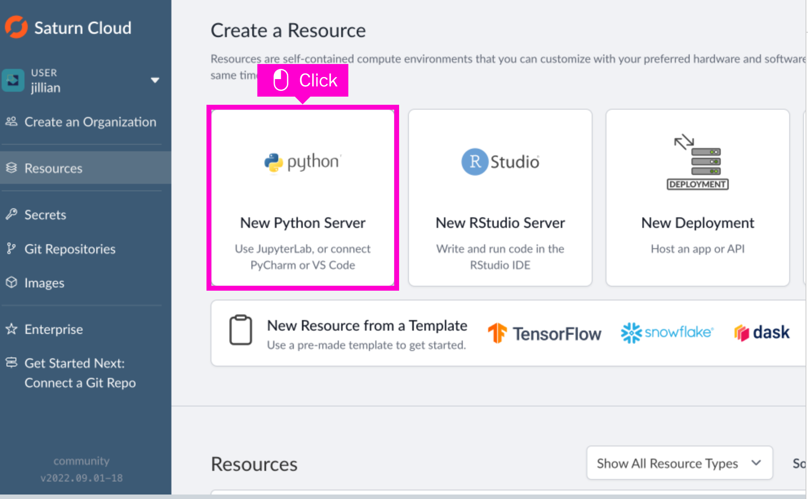
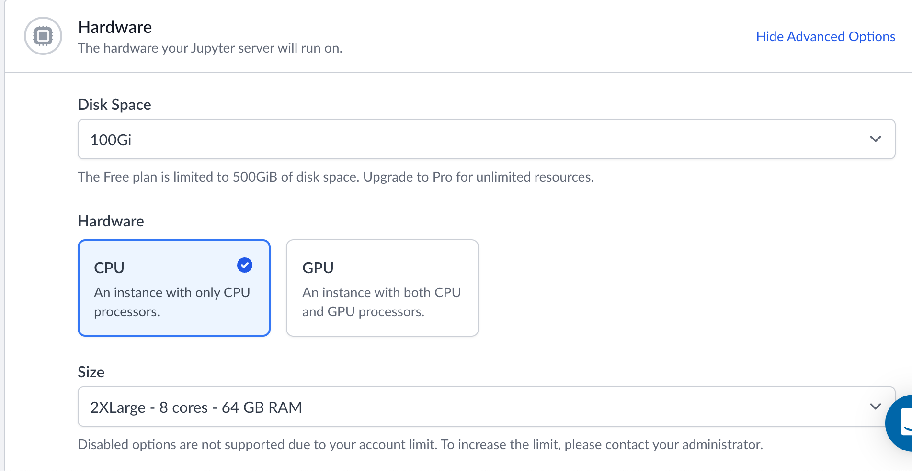
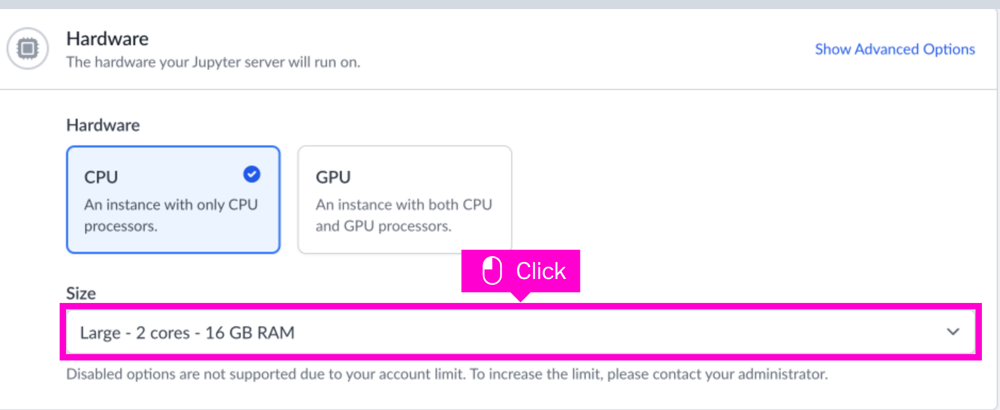
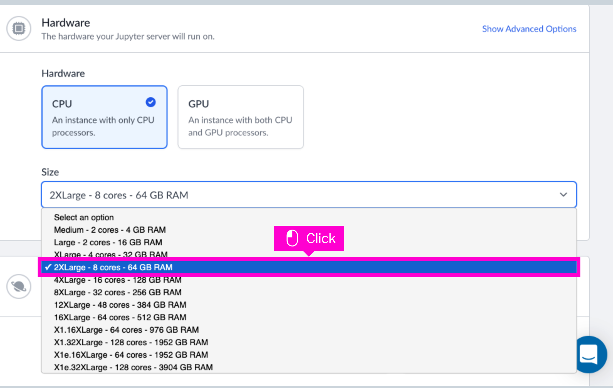
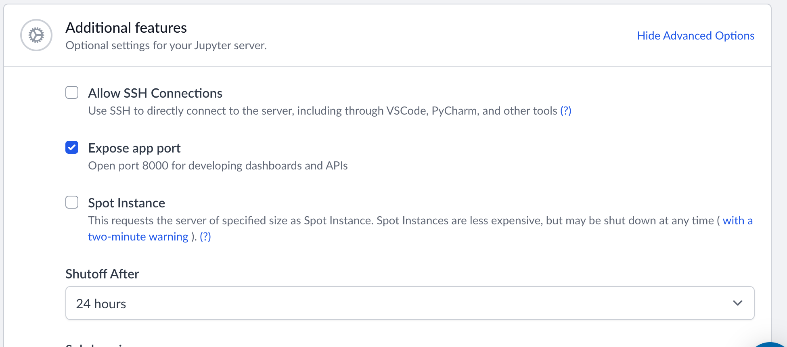
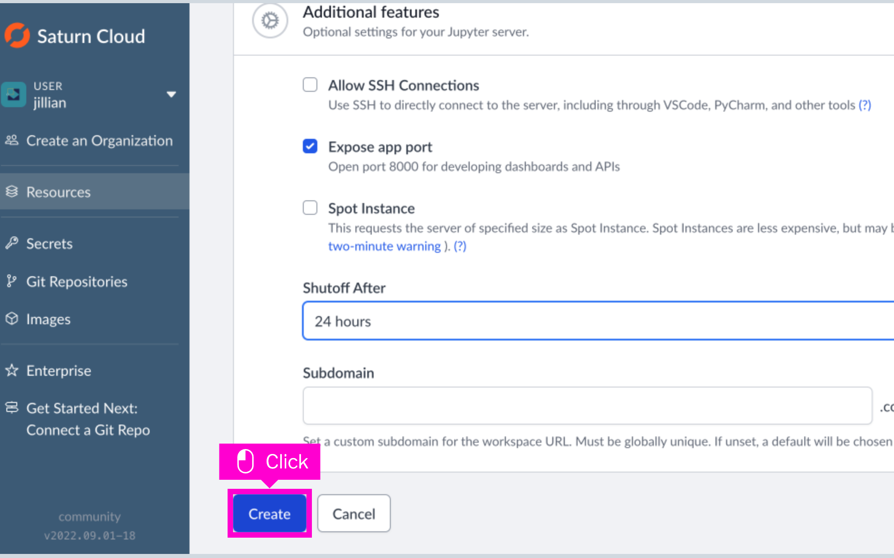
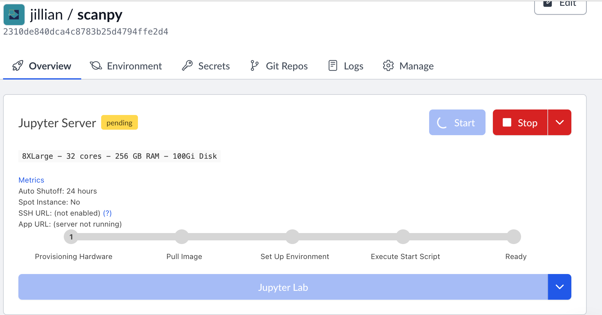

# Single Cell Analysis on Saturn Cloud

## Requirements

* A saturn cloud account. 
    * The free account is fine for this example.
* Optionally, instead of Saturn Cloud you can use any computer with conda/mamba and internet connectivity.
* Optional - S3 Bucket with Read/Write access.

That's it!

## Setup - Saturn Cloud

The Saturn Cloud UI is fairly self explanatory. 

### Create a Resource

* Create a new Python Server resource type.


### Choose your Hardware Specs

* Choose a CPU Instance Type
 
   (We're not doing anything here that requires a GPU.)
* Choose your memory requirements
  * From the Size dropdown choose an instance type.



### Environment

* Customize your environment

  * I went with the default saturn cloud datascience environemnt. If you're using tensorflow or pytorch you may want to choose those environments.
* Add your System Packages of choice. I went for `htop tree vim build-essential`
* Optional - Add your pip packages. `scanpy louvain quilt3[catalog,pyarrow]`

* Open a Port for Web Applications
    * Click on the *Advanced Options* in the **Environment** tab in order to open a port.
    * This step is necessary if you want to follow along with the visualization portion of the tutorial!


## Review and Launch

* Once you've reviewed your settings click *Create* and you'll be ready to go.



On the next page press the *Start* button, and then the *JupyterLab* button.



### Optional - ExcellxGene Setup

Excellxgene needs to be installed to it's own conda environment because it doesn't play nice with the existing conda env.

```bash
mamba env create -f ./excellxgene-environment.yaml -p ~/.conda/envs/excellxgene
source activate conda activate /home/jovyan/.conda/envs/excellxgene
```

## Setup - Local

* Grab the `excellxgene-environment.yaml` from this repo.

```bash
mamba env create -f ./excellxgene-environment.yaml
```

## Data Analysis

You can grab the [scanpy tutorials](https://github.com/scverse/scanpy-tutorials) with:

```bash
git clone https://github.com/scverse/scanpy-tutorials
```

I'm only going over the `pbmc3k.ipynb` notebook. It's supplied here because I made one very minor change, but all accolodes should go to the ScanPy team.
